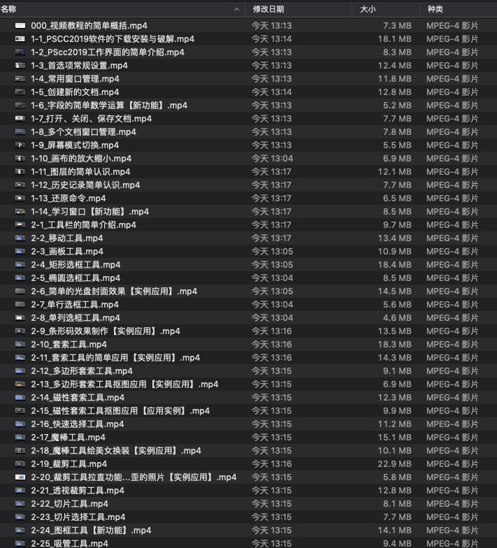
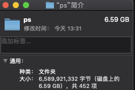

# cy_spider
**项目结构** 
```
cy_spider
├─bin 执行脚本
│  ├─run.bat 执行（windows）
│  └─run.sh  执行（mac、linux）
├─cy_spider 爬虫相关
│  │─file 谷歌浏览器驱动文件（需浏览器渲染完才能抓取时使用）
│  │─spiders 爬虫
│  │    ├─BaseSpider.py  爬虫父类
│  │    └─XiaoBeiSpider.py 小贝PS教程视频爬虫
│  ├─items.py 指定保存文件的数据结构
│  ├─middlewares.py  中间件，处理request和reponse等相关配置
│  └─pipelines.py 项目管道，可以输出items
│  └─settings.py  设置文件，指定项目的一些配置
├─util 工具类
│  ├─cy_logger.py 日志
│  ├─sqlite3_util.py sqlite3工具类
│  └─sqlite3_util_test.py sqlite3工具类使用方式
├─scrapy.cfg scrapy配置 
├─README.md 说明文件
├─requirements.txt 依赖包
└─run.py 执行
```
**依赖包**
```
命令行安装
pip install scrapy
pip install selenium
pip install pypiwin32
也可以使用下面命令批量安装(本人本地环境，有些可以不安装)
pip install -r requirements.txt
选择安装
pip install pymysql
pip install qiniu
pip install DBUtils
pip install bs4
```
**如windows安装scrapy失败手动下载安装twisted，后安装scrapy**
- [下载twisted](https://www.lfd.uci.edu/~gohlke/pythonlibs/#twisted)
- pip install Twisted-18.9.0-cp37-cp37m-win_amd64.whl

**执行**
```
根目录执行
scrapy crawl 爬虫名称 -s LOG_FILE=/logs/spider.log
IDEA 直接执行run.py文件
```

**效果**





**其它**
- 码云仓库:http://gitee.com/bzj/cy_spider
- github仓库：https://github.com/bzjsky/cy_spider